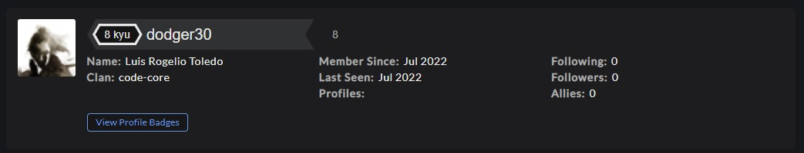
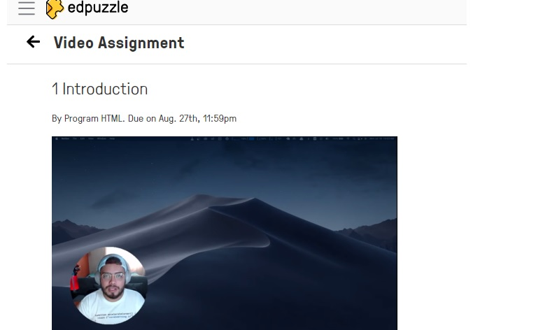
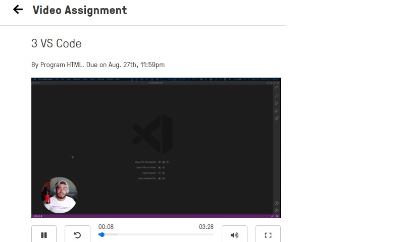

# JavaScript

## 1. Challenge de la Semana (Lunes)

        - Continuar con el Curso de Git

        - Crear una cuenta de Codewars

<details><summary><strong>Respuesta</strong></summary>



</details>

        - Comando If - Else

        - Comando for

        - Comando While

        - Funciones

## 2. Challenge de la Semana (Martes)

        - Iniciar el Curso de HTML

<details><summary><strong>Respuesta</strong></summary>



</details>

        - Ejercicio. Multiplicacion

<details><summary><strong>Respuesta</strong></summary>

```JavaScript

function multiply(a, b){
  //Se modifico la funcion para que regresara el resultado de la multiplicacion.
  return (a * b);
}

```

</details>

        - Ejercicio. ASCII Total

<details><summary><strong>Respuesta</strong></summary>

```JavaScript

function uniTotal (string) {
// Convirtiendo de String a Codigo ASCII
  let Cadena = 0;
  
  if (string != "")
    for (let i=0; i<string.length; i++) {
      Cadena = Cadena + string.charCodeAt(i);
    }
    
  return Cadena;
}

```

</details>

## 3. Challenge de la Semana (Miercoles)

        - Continuar con el curso de HTML

<details><summary><strong>Respuesta</strong></summary>



</details>

        - Ejercicio. Char a Valor ASCII

<details><summary><strong>Respuesta</strong></summary>

```JavaScript

function getChar(c){
  // Funcion para convertir un valor entero a Codigo ASCII
  
  caracter = String.fromCharCode(c);
  return caracter;
}

```

</details>

        - Ejercicio. Suma Binaria

<details><summary><strong>Respuesta</strong></summary>

```JavaScript

function addBinary(a,b) {
  var resultado = (a + b);
  var cadena = '';
  var cadena2 = '';
  
  do {
     residuo = (resultado % 2);
     cadena = cadena + residuo;
     resultado = Math.trunc(resultado/2);
  } while (resultado !== 0);
  
  for (var i=cadena.length - 1; i >= 0; i--) {
    cadena2 = cadena2 + cadena[i];
  }
  return cadena2;
}

```
</details>

        - Ejercicio. Nota Final del Estudiante

<details><summary><strong>Respuesta</strong></summary>

```JavaScript

function finalGrade (exam, projects) {
  let nota_final = 0
  
  if ((exam >90) || (projects >10)) {
    nota_final = 100
  } else if ((exam >75) && (projects >=5)) {
    nota_final = 90
  } else if ((exam >50) && (projects >=2)) {
    nota_final = 75
  }   
  return nota_final     // final grade
}

```
</details>

## 4. Challenge de la Semana (Jueves)

        - Continuar con el curso de HTML

<details><summary><strong>Respuesta</strong></summary>


</details>

        - Ejercicio. Remover puntos de exclamacion.

        - Ejercicio. Remover Vowel

        - Ejercicio. Piedra, Papel o Tijera

        - Ejercicio. Bugger Persistente

## 5. Ejercicios Extra 

        - Ejercicio. Holiday VIII - Duty Free

        - Ejercicio. Twice as Old

        - Ejercicio. Valid Spacing

        - Ejercicio. Fake Binary