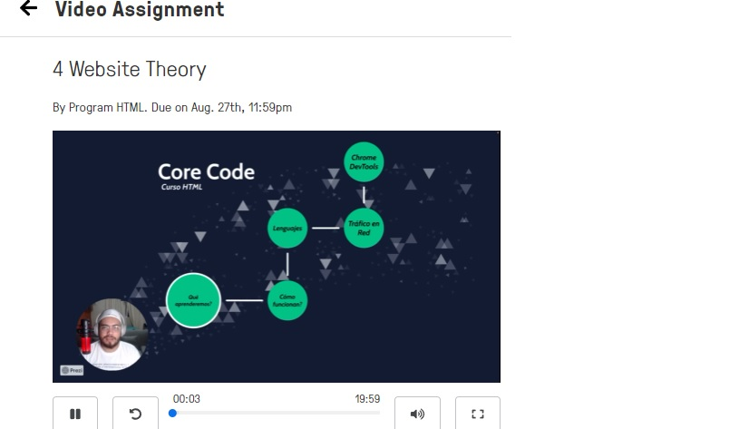

# JavaScript - Parte 1

## 1. Challenge de la Semana (Lunes)

        - Continuar con el Curso de Git

<details><summary><strong>Respuesta</strong></summary>


</details>

        - Crear una cuenta de Codewars

<details><summary><strong>Respuesta</strong></summary>


</details>

        - Comando If - Else

<details><summary><strong>Respuesta</strong></summary>

La expresión IF THEN ELSE puede definirse de dos maneras:

IF (condición booleana) THEN (valor verdadero) ELSE (valor falso) ENDIF: el resultado devuelto dependerá de si la condición se cumple o no.

IF (condición booleana) THEN (valor verdadero) ENDIF: el resultado devuelto siempre será el resultado verdadero. Si la expresión condicional no se cumple, el resultado estará vacío.

</details>

        - Comando for

<details><summary><strong>Respuesta</strong></summary>        

los bucles (ciclos) son utilizados para realizar tareas repetitivas con base en una condición. Las condiciones típicamente devuelven true (verdadero) o false(falso) al ser evaluados. El bucle continuará ejecutándose hasta que la condición devuelva  false.

Sintaxis:

for ([initializacion]); [condicion]; [expresion-final]) {
   // sentencias
}

</details>

        - Comando While

<details><summary><strong>Respuesta</strong></summary>

El bucle while empieza por evaluar la condición. Si la condición es verdadera (devuelve true), entonces las sentencias son ejecutadas. Si la condición es falsa (devuelve false), entonces las sentencias no son ejecutadas. Luego el bucle finaliza.

Sintaxis:
while (condicion)
{
  sentencia(s);
}

</details>

        - Funciones

<details><summary><strong>Respuesta</strong></summary>

Una función es un conjunto de instrucciones que se agrupan para realizar una tarea concreta y que se pueden reutilizar fácilmente.

</details>

## 2. Challenge de la Semana (Martes)

        - Iniciar el Curso de HTML

<details><summary><strong>Respuesta</strong></summary>


</details>

        - Ejercicio. Multiplicacion

<details><summary><strong>Respuesta</strong></summary>

```JavaScript

function multiply(a, b){
  //Se modifico la funcion para que regresara el resultado de la multiplicacion.
  return (a * b);
}

```

</details>

        - Ejercicio. ASCII Total

<details><summary><strong>Respuesta</strong></summary>

```JavaScript

function uniTotal (string) {
// Convirtiendo de String a Codigo ASCII
  let CadenaEnASCII = 0;
  
  if (string != "")
    for (let i=0; i<string.length; i++) {
      CadenaEnASCII += string.charCodeAt(i);
    }
    
  return CadenaEnASCII;
}

```

</details>

## 3. Challenge de la Semana (Miercoles)

        - Continuar con el curso de HTML

<details><summary><strong>Respuesta</strong></summary>


</details>

        - Ejercicio. Char a Valor ASCII

<details><summary><strong>Respuesta</strong></summary>

```JavaScript

function getChar(c){
  // Funcion para convertir un valor entero a Codigo ASCII
  
  caracter = String.fromCharCode(c);
  return caracter;
}

```

</details>

        - Ejercicio. Suma Binaria

<details><summary><strong>Respuesta</strong></summary>

```JavaScript

function addBinary(a,b) {
  var resultado = (a + b);
  var cadena = '';
  var cadena2 = '';
  
  do {
     residuo = (resultado % 2);
     cadena = cadena + residuo;
     resultado = Math.trunc(resultado/2);
  } while (resultado !== 0);
  
  for (var i=cadena.length - 1; i >= 0; i--) {
    cadena2 = cadena2 + cadena[i];
  }
  return cadena2;
}

```
</details>

        - Ejercicio. Nota Final del Estudiante

<details><summary><strong>Respuesta</strong></summary>

```JavaScript

function finalGrade (exam, projects) {
  let nota_final = 0
  
  if ((exam >90) || (projects >10)) {
    nota_final = 100
  } else if ((exam >75) && (projects >=5)) {
    nota_final = 90
  } else if ((exam >50) && (projects >=2)) {
    nota_final = 75
  }   
  return nota_final     // final grade
}

```
</details>

## 4. Challenge de la Semana (Jueves)

        - Continuar con el curso de HTML

<details><summary><strong>Respuesta</strong></summary>



</details>

        - Ejercicio. Remover puntos de exclamacion.

<details><summary><strong>Respuesta</strong></summary>

```JavaScript

function remove (string) {  
  string2 = '';
  
  // Verificamos si al menos contiene el simbolo '!' al final de la cadena
  if (string.lastIndexOf("!") == string.length -1 ) {
    ultimo = string.length;
    var i = string.length -1;
    while (i >= 0) {
       if (string[i] == "!") {
         ultimo = i; 
       } else {
           break;
       }
      i--;
    }
    string2 = string.substring(0,ultimo);
  } else {
    string2 = string;
  }
  return string2;
}

```

</details>

        - Ejercicio. Remover Vowel

<details><summary><strong>Respuesta</strong></summary>

```JavaScript

function shortcut(string){
  return string.replace(/[aeiou]/g,'')
}

```

</details>

        - Ejercicio. Piedra, Papel o Tijera

<details><summary><strong>Respuesta</strong></summary>

```JavaScript

const rps = (p1, p2) => {
  var winner = "";
  if (p1 === p2) {
    winner = "Draw!";
  } else {
    switch(p1) {
      case "rock":
        winner = (p2 === "paper") ? "Player 2 won!" : "Player 1 won!";
        break;
      case "paper":
        winner = (p2 === "rock") ? "Player 1 won!" : "Player 2 won!";
        break;
      default:
        winner = (p2 === "paper") ? "Player 1 won!" : "Player 2 won!";
    }
  }
  return winner;
}

```

</details>

        - Ejercicio. Bugger 

<details><summary><strong>Respuesta</strong></summary>

```JavaScript

function persistence(num) {  
  let string = num.toString();
  let digitos = string.length;
  let contador = 0;
  let resultado = 1;
  
  while(digitos > 1) {
    resultado = 1;
    for(let i = 0; i <= string.length-1; i++) {
      resultado *= Number(string[i]);
    }
    num = resultado;
    contador++;
    string = num.toString();
    digitos = string.length;
  }
  //devolvemos la respuesta con el numero de veces que realizo la multiplicacion
  return contador;
}

```

</details>


## 5. Ejercicios Extra 

        - Ejercicio. Holiday VIII - Duty Free

<details><summary><strong>Respuesta</strong></summary>

```JavaScript

function dutyFree(normPrice, discount, hol){
  let costo = 0;
  
  // Si el descuento es 0, solo dividimos el precio entre 100
  if (discount == 0) {
    costo = (normPrice) / 100;  
  } else {
    costo = (normPrice * discount) / 100;
  }
  
  respuesta = parseInt(hol / costo);
  return respuesta;
}

```
</details>

        - Ejercicio. Twice as Old

<details><summary><strong>Respuesta</strong></summary>

```JavaScript

function twiceAsOld(dadYearsOld, sonYearsOld) {
  // Calcular hace cuantos años el padre tuvo el doble de la edad del hijo o en cuantos años lo tendra.
  var fecha = (dadYearsOld - sonYearsOld * 2);
  if (fecha < 0) {
    fecha = fecha * -1;
  }
  return fecha;
}

```

</details>

        - Ejercicio. Valid Spacing

<details><summary><strong>Respuesta</strong></summary>

```JavaScript

function validSpacing(s) {
  // Validar que exista espacio en blanco
  
  posicion = s.indexOf(' ');
  if (posicion === -1) { //Preguntamos si No existe algun espacio en BLANCO
    respuesta = true;
  } else if (s[0] == ' ' || s[s.length-1] == ' ') {
      respuesta = false;
  } else if (s.indexOf('  ') == -1) {
    respuesta = true;
  } else {
    respuesta = false;
  }
  return respuesta;
}

```

</details>

        - Ejercicio. Fake Binary

<details><summary><strong>Respuesta</strong></summary>

```JavaScript

function fakeBin(x){
  let numero = '';
  
  for (let i = 0; i <= x.length -1; i++) {
    numero = (x[i] < 5) ? numero + '0' : numero + '1'
  }
  return numero;
}

```

</details>